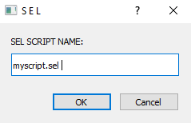
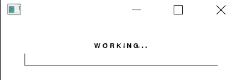
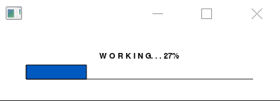
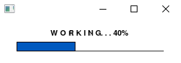
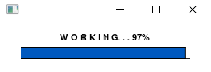
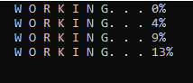
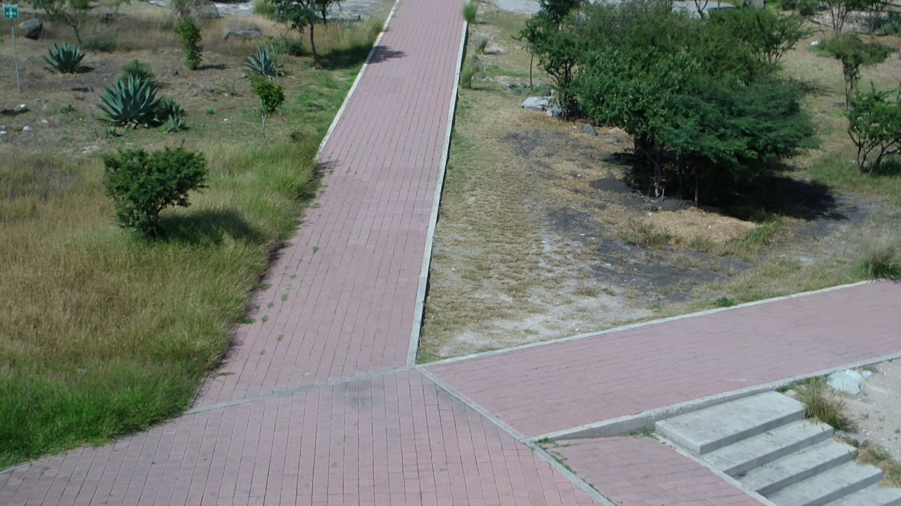
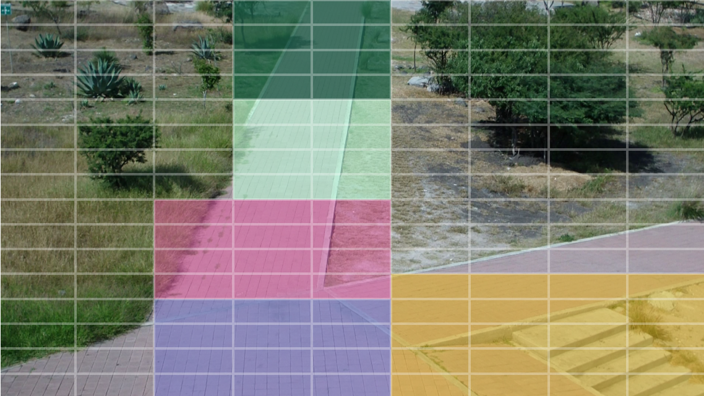
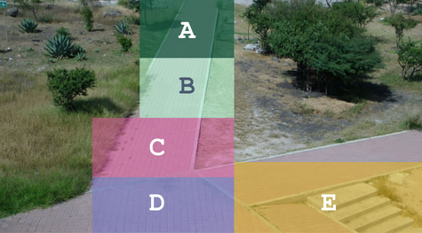

# State-Based Language (SEL): Modeling for Dynamic Activity Detection Across Different Scenarios

## Overview

The **State-Based Language (SEL)** is an open-source tool designed to model and detect activities in dynamic environments, particularly in motion analysis and video comprehension. It provides a structured approach to representing movement behaviors, system monitoring, and activity recognition through a deterministic framework.

SEL is highly configurable and modular, implemented with logical structures and motion primitives such as sequencing, parallelism, and concurrency.It enables the development of precise models for dynamic scene analysis, making it suitable for applications in automated video understanding, simulation, and more.

SEL consists of multiple modes to address various challenges in motion modeling and activity recognition, including:
- **Structured motion representation** for defining movement behaviors in complex environments.
- **Deterministic activity detection** to ensure reliable recognition of motion patterns.
- **Scalable modeling** for applications ranging from controlled settings to real-world dynamic scenarios.

As an accessible tool, SEL does not require prior expertise, making it valuable for researchers, engineers, and developers working in computer vision.

---

## Primitives of SEL

The **State-Based Language (SEL)** includes a set of fundamental primitives that define its structure and functionality for modeling and detecting activities in dynamic environments:

- **SEQ (Sequence ):** A primitive that ensures the ordered execution of movements, maintaining a structured flow of motion dynamics.
- **PAR (Parallel):** Allows the parallel execution of movements, where multiple activities occur either independently or synchronized, optimizing workflow and efficiency.
- **CON (Concurrency):** A primitive for modeling synchronized movements that occur simultaneously, ensuring proper coordination.

Users can select the appropriate primitive of SEL based on their modeling needs. Each primitive is designed to handle specific activity  and can be implemented using simple logic structures. 
The primitives are flexible and can be integrated into different activities, making them ideal for modeling dynamic activities and movement behaviors effectively.

---

## Usage ##

### 1. Install Octave (if not already installed)

- Download **Octave** from its [official site](https://www.gnu.org/software/octave/) and follow the installation instructions.

### 2. Download the SEL repository

- Clone or download the **SEL repository** to your local directory.
- Click the green **"Code"** button on the SEL main page and choose **"Download ZIP"**.

### 3. Open the CLI (Command Line Interface)

- Open the command line interface (CLI) on your system.

### 4. Navigate to the directory containing the folder

- Use the following command to navigate to the directory where the repository was downloaded:
  ```bash
  cd('URL\EXAMPLE')
 ### 5.  Run SELCompiler: 
 - Execute SELCompiler with the appropriate command. This will compile and run the SEL code.

### 6. Specify the Script Location: 
- Enter the URL for the location of the SEL script. This is the path where your script is located.
<br>


### 7. Wait for Execution:
-  Allow the process to run and complete. This may take some time depending on the size and complexity of the model.
<br>

<br>

<br>


### 8. View the Results:
-  The results will be displayed in the Octave console.
<BR>


### 9. Save the Results: 
- The results document will be saved in the same location as the script.

## **Creating the SEL Script**

### 1. Understand the SEL Language Rules:
- Familiarize yourself with the basic syntax and rules of the SEL language.

### 2. Create a Script with a ".sel" Extension: 
- Write your script with the .sel file extension, which will define the activities, transitions, and movements.

### 3. Determine the Video to Process: 
- Select the video file that will be processed by the model. Make sure it is in a compatible format.

### 4.Create the States:
- Define the states that represent various activities and transitions in the video.

### 5. Create the Activities: 
- Specify the activities to be monitored and executed during the video processing.

### 6. Validate the Script’s: 
- Ensure the script adheres to the SEL language rules and is syntactically correct.

## **EXAMPLE**

## **1. Select the Scenario**
- Choose the video to analyze.
<br>

## **2. Analyze the Scenario**
- Identify key elements in the scene, such as moving objects, regions of interest, and expected activities.

## **3. Segment the Scene and define States**
- Divide the video into meaningful segments based on detected events.
- Establish transitions between different activities.
<br>
<br>
<br>
  ```text
  
  state b=[(5,5),(4,5),(4,6),(5,6),(5,7),(4,7),(4,8),(5,8)];
  state a=[(4,2),(5,3),(5,2),(4,3),(5,4),(4,4),(4,1),(5,1)];
  state c=[(3,9),(4,9),(5,9),(5,10),(3,10),(3,11),(4,11),(3,12),(5,12),(5,11),(4,10),(4,12)];
  state d=[(3,13),(4,13),(5,13),(3,14),(4,14),(5,14),(5,15),(4,15),(3,15),(3,16),(5,16),(4,16)];
  state e=[(6,12),(7,12),(8,12),(9,12),(9,13),(8,13),(7,13),(6,13),(6,14),(7,14),(8,14),(9,14),(6,15),(7,15),(8,15),(9,15),(7,16),(6,16),(8,16),(9,16)];

## **4. Model Activities**
- Specify the actions and behaviors to be monitored.
  ```text
      seq(A,B,C,D);  %DirectRoute
      par(A,E);      %MotionTwoFronts
      con(D,E)       %BusyZone
## **5. Create Script**
  ```text

example.sel

module example;
export "example.mp4";
  state b=[(5,5),(4,5),(4,6),(5,6),(5,7),(4,7),(4,8),(5,8)];
  state a=[(4,2),(5,3),(5,2),(4,3),(5,4),(4,4),(4,1),(5,1)];
  state c=[(3,9),(4,9),(5,9),(5,10),(3,10),(3,11),(4,11),(3,12),(5,12),(5,11),(4,10),(4,12)];
  state d=[(3,13),(4,13),(5,13),(3,14),(4,14),(5,14),(5,15),(4,15),(3,15),(3,16),(5,16),(4,16)];
  state e=[(6,12),(7,12),(8,12),(9,12),(9,13),(8,13),(7,13),(6,13),(6,14),(7,14),(8,14),(9,14),(6,15),(7,15),(8,15),(9,15),(7,16),(6,16),(8,16),(9,16)];
  begin;
      seq(A,B,C,D);  %DirectRoute
      par(A,E);      %MotionTwoFronts
      con(D,E)       %BusyZone
  end;


